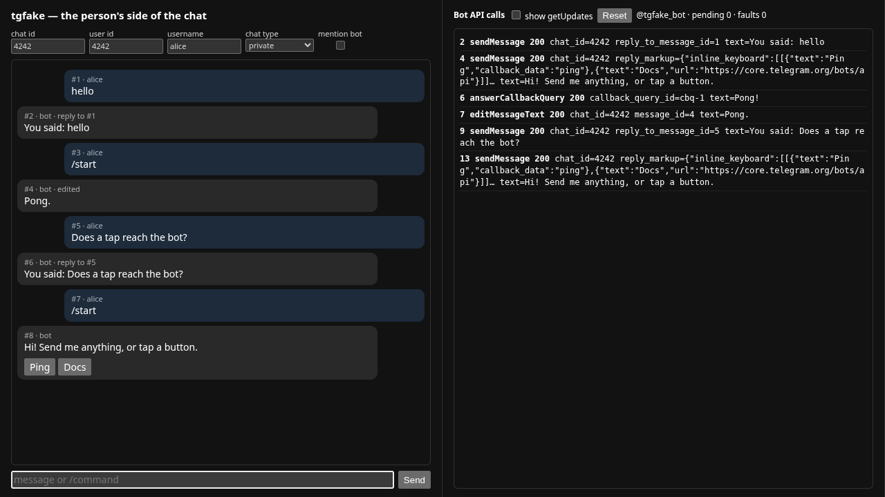

# tgfake

**tgfake server** is a fake Telegram Bot API for testing bots offline. It
answers the Bot API methods a bot calls, keeps the chats the bot writes to,
and lets a test, a CI job or a person at a browser play the user: send
messages, tap inline buttons, open Mini Apps, and make Telegram fail on
purpose. No token, no phone, no network.



- **A real Bot API surface.** `getMe`, long-polled `getUpdates` with
  `offset` and `allowed_updates`, `sendMessage`, `editMessageText`,
  `answerCallbackQuery`, photos and documents, chat actions, bot commands,
  the menu button, and the Bot API 10.1 rich messages and drafts with the
  10.3 Stop button. Forms, JSON and multipart are all accepted, so any Bot
  API library works unchanged.
- **Strict where Telegram is strict.** An edit that changes nothing, a reply
  to a message that is not there, an answer to an unknown callback query, a
  second answer to the same one, `callback_data` over 64 bytes, a `null`
  keyboard: each is refused with Telegram's own error, so the bug shows up in
  the test and not in a user's chat.
- **The person's side, scriptable.** A [simulation API](docs/sim-api.md)
  under `/sim/` injects messages and taps, returns the transcript and every
  Bot API call, schedules faults such as a 429 flood or an outage, and opens
  Mini Apps with launch data signed by the bot's token.
- **A chat page.** `http://127.0.0.1:18790/` is a Telegram client for the
  bot: type messages, tap buttons, open Mini Apps in a phone frame and watch
  the Bot API calls arrive.
- **A scripted model.** `--llm` also serves an OpenAI-compatible
  `/v1/chat/completions` that answers by rule, in turn or by echo, streams
  word by word and can call a tool, so an LLM bot runs with no key.
- **Two ways in.** A single static binary for Linux, macOS and Windows, or a
  Go package to run in-process on `httptest`.

## Install

Download a release archive from the
[releases page](https://github.com/EvilFreelancer/tgfake/releases), or let
the install script pick the one for your system and check its checksum:

```bash
curl -sSfL https://raw.githubusercontent.com/EvilFreelancer/tgfake/main/scripts/install.sh | sh -s -- -b ~/.local/bin
```

With Go 1.22 or newer:

```bash
go install github.com/EvilFreelancer/tgfake/cmd/tgfake@latest
```

In GitHub Actions, the [action](docs/ci.md) installs it and can start it:

```yaml
- uses: EvilFreelancer/tgfake@v1.0.0   # installs the v1.0.0 binary
  with:
    start: "true"
    args: --llm
```

## Quick start

Start the stand:

```bash
tgfake --llm
```

```text
tgfake v1.0.0: fake Bot API for @tgfake_bot at http://127.0.0.1:18790
  Bot API:    http://127.0.0.1:18790/bot<token>/<method>  (in place of https://api.telegram.org)
  chat page:  http://127.0.0.1:18790/
  sim API:    http://127.0.0.1:18790/sim/
  model:      http://127.0.0.1:18790/v1  (OpenAI-compatible, model tgfake-demo, any API key)
```

Point the bot at `http://127.0.0.1:18790` instead of
`https://api.telegram.org`. Any token is accepted unless `--token` names one.
Most libraries take the address as an option:

| Library | Setting |
|---------|---------|
| python-telegram-bot | `Application.builder().token(TOKEN).base_url("http://127.0.0.1:18790/bot")` |
| aiogram 3 | `Bot(TOKEN, session=AiohttpSession(api=TelegramAPIServer.from_base("http://127.0.0.1:18790")))` |
| pyTelegramBotAPI | `telebot.apihelper.API_URL = "http://127.0.0.1:18790/bot{0}/{1}"` |
| Telegraf | `new Telegraf(TOKEN, { telegram: { apiRoot: "http://127.0.0.1:18790" } })` |
| grammY | `new Bot(TOKEN, { client: { apiRoot: "http://127.0.0.1:18790" } })` |
| node-telegram-bot-api | `new TelegramBot(TOKEN, { polling: true, baseApiUrl: "http://127.0.0.1:18790" })` |
| go-telegram-bot-api v5 | `tgbotapi.NewBotAPIWithAPIEndpoint(TOKEN, "http://127.0.0.1:18790/bot%s/%s")` |
| go-telegram/bot | `bot.New(TOKEN, bot.WithServerURL("http://127.0.0.1:18790"))` |

Then open the chat page and talk to the bot, or drive it from a script. With
the [example bot](examples/echobot) running against the stand
(`TELEGRAM_API=http://127.0.0.1:18790 BOT_TOKEN=123:fake go run ./examples/echobot`):

```bash
curl -s -X POST http://127.0.0.1:18790/sim/message -d '{"text": "hello"}'
curl -s "http://127.0.0.1:18790/sim/chat/4242?format=text"
```

```text
[1] alice: hello
[2] bot: You said: hello
```

## Testing a bot

**Any language.** Start the binary and the bot as two processes and check
the chat through the simulation API. [`examples/shell/bot-e2e.sh`](examples/shell/bot-e2e.sh)
is a complete test of that shape: it sends a message, waits for the answer,
taps a button and injects a flood-control fault. Set `BOT_CMD` to run it
against your own bot.

**Go.** Run the server in-process and drive it through its Go API:

```go
import "github.com/EvilFreelancer/tgfake/pkg/server"

fake := server.New(server.Options{})
srv := httptest.NewServer(fake.Handler())
defer func() { fake.Close(); srv.Close() }() // release long polls first

go runBot(ctx, srv.URL) // the bot under test, its API origin set to srv.URL

fake.InjectMessage(server.IncomingMessage{Text: "hello"})
fake.WaitCall("sendMessage", 1, 5*time.Second)
fmt.Print(fake.Chat(4242).Text()) // [1] alice: hello / [2] bot: ...
```

[`examples/echobot`](examples/echobot) is a bot written with the standard
library and its tests; [docs/go.md](docs/go.md) covers the whole Go API.

**CI.** The action installs a release on Linux, macOS and Windows runners and
can start it in the background; [docs/ci.md](docs/ci.md) has workflows for
GitHub Actions and the install script for everything else.

## Documentation

| Page | What it covers |
|------|----------------|
| [docs/command.md](docs/command.md) | Every flag of the `tgfake` command, the banner, signals and exit codes. |
| [docs/bot-api.md](docs/bot-api.md) | The Bot API methods served, what each refuses the way Telegram does, and what is not implemented. |
| [docs/sim-api.md](docs/sim-api.md) | The simulation API: messages, taps, transcripts, the outbox, faults, Mini App launches, reset. |
| [docs/mini-apps.md](docs/mini-apps.md) | `web_app` buttons, the menu button, signed launch data and the phone frame of the chat page. |
| [docs/scripted-model.md](docs/scripted-model.md) | The OpenAI-compatible model of `--llm`: answers, rules, tool calls, streaming. |
| [docs/go.md](docs/go.md) | Using the packages from Go tests: `server`, `botapi`, `webapp`, `llmstub`. |
| [docs/ci.md](docs/ci.md) | The GitHub Action, the install script and running the stand in other CI systems. |
| [docs/development.md](docs/development.md) | Building, testing, the layout of the repository and cutting a release. |

## History

tgfake started as the offline Telegram stand of
[Coddy](https://github.com/coddy-project/coddy-agent), whose Telegram gateway
is tested against it, and moved into this repository with its history.

## License

[MIT](LICENSE)
